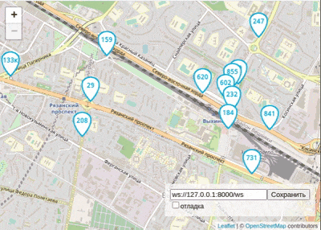

# Buses on a map of Moscow

The application shows movement of buses on a map of Moscow.



## Requirements

* Python 3.8+ (3.7 should be ok too but if you can please use the newer version)
* [Poetry](https://github.com/python-poetry/poetry) for managing dependencies.

If you don't want to use poetry for some reason - you can use `virtualenv`. Just check `pyproject.toml` to see which python packages you need to install.

## How to install

* `poetry install` will create virtualenv and install all dependencies.
* `poetry shell` will activate virtualenv

## How to run

### Server

Run 
```commandline
python server.py
```

With default settings the server will listen for incoming websocket 
connections from frontend on `127.0.0.1:8000`
and on `127.0.0.1:8080` to receive data from a `bus data gate` (or bus emulator in our case)

**Settings for `server.py`**

| Environment variable |  CLI variable | Default |  Description  |
|---|---|---|---|
| BUS_HOST  | --host  | 127.0.0.1  | Server address  |
| BUS_PORT  | --bus_port  | 8080  | Receive data from bus emulator through this port |
| BUS_BROWSER_PORT  | --browser_port  | 8000  | Communicate with browser through this port  |
| BUS_VERBOSE  | -v  | 0  | Logging level |

There are 3 logging levels - 0 - default, 1 - verbose, 2 - more verbose

With CLI you can specify it `-v`, `-vv`


### Bus data emulator

For simulation movement of buses you have to run the script `fake_bus.py` in another terminal window.

```commandline
python fake_bus.py
```

**Settings for `fake_bus.py`**

| Environment variable |  CLI variable | Default |  Description  |
|---|---|---|---|
| FAKE_SERVER  | --server  | ws://127.0.0.1:8080/ws  | Server address  |
| FAKE_ROUTES_NUMBER  | --routes_number, -r  | -  | Number of routes (If not set all available routes will be used). |
| FAKE_BUSES_PER_ROUTE  | --buses_per_route, -x  | 1  | Number of buses on each route |
| FAKE_WEBSOCKETS_NUMBER  | --websockets_number, -w  | 5 | Number of opened websocket connections to server.py |
| FAKE_EMULATOR_ID  | --emulator_id, -e  | '' | busId prefix in case few bus emulators will run in parallel |
| FAKE_REFRESH_TIMEOUT  | --refresh_timeout, -t  | 1 | Delay between coordinates switch. |
| FAKE_VERBOSE  | --verbose, -v  | 0 | Logging level (-v, -vv). |

There are 3 logging levels - 0 - default, 1 - verbose, 2 - more verbose

With CLI you can specify it `-v`, `-vv`

Possible bus routes are located in `routes` folder. If `--routes_number` is not set the emulator will use all of them.

### Frontend

Just open `frontend/index.html` in your browser

At the bottom right of the page, you can enable logging debug mode and specify a non-standard web socket address.


The settings are saved in the Local Storage and persist after the page is reloaded.
To reset the settings, remove the keys from the Local Storage using `Chrome Dev Tools -> Application tab -> Local Storage.`

If something does not work as expected, start by enabling debugging.


## Data format

Frontend expects to receive JSON message with a list of buses from server:

```json
{
  "msgType": "Buses",
  "buses": [
    {"busId": "c790сс", "lat": 55.7500, "lng": 37.600, "route": "120"},
    {"busId": "a134aa", "lat": 55.7494, "lng": 37.621, "route": "670к"},
  ]
}
```

Buses that are not present in the last message's list are removed from the map.

The frontend tracks field of view of the user and sends to the server new coordinates of the window:

```json
{
  "msgType": "newBounds",
  "data": {
    "east_lng": 37.65563964843751,
    "north_lat": 55.77367652953477,
    "south_lat": 55.72628839374007,
    "west_lng": 37.54440307617188,
  }
}
```

## Used libraries

- Frontend
- [Leaflet](https://leafletjs.com/) — for drawing a map
- [loglevel](https://www.npmjs.com/package/loglevel) - for logging

- Backend
- [Trio](https://trio.readthedocs.io/en/stable/) - for python async
- [Trio-Websocket](https://pypi.org/project/trio-websocket/) - for websocket processing
- [click](https://click.palletsprojects.com) - for CLI arguments
- [Pydantic](https://pydantic-docs.helpmanual.io/) - for data validation


## Project Goals

The code is written for educational purposes to solve the task from [Devman](https://dvmn.org).


